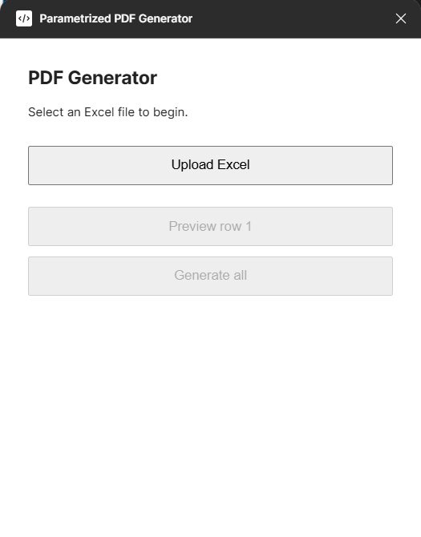

# Figma Parametrized PDF Generator

[English version](README.md)



## Цель

Этот локальный инструмент автоматизирует повторяющуюся работу в Figma. У вас есть два Frame-шаблона и Excel-таблица, например на 100 строк. Каждая строка содержит данные для одного бухгалтерского отчета. Вместо ручного копирования Frame и замены текста plugin сам подставляет данные, создает PDF и переходит к следующей строке.

Каждый PDF состоит из двух страниц, потому что используются два Frame. Пример результата:

```text
report_001.pdf
report_002.pdf
output.zip
```

Все работает локально: база данных, аккаунт и облачный сервис не нужны.

## 1. Разметьте два Frame в Figma

1. Откройте файл в Figma.
2. Подготовьте два Frame. Первый станет первой страницей PDF, второй второй страницей.
3. В местах, где должны появляться данные, напишите placeholder в двойных фигурных скобках:

```text
Компания: {{company_name}}
Период: {{report_period}}
Доходы: {{revenue}} ₽
Расходы: {{expenses}} ₽
Прибыль: {{profit}} ₽
```

4. Имена внутри скобок должны состоять из латинских букв, цифр и `_`.
5. Один placeholder можно повторять сколько угодно раз и размещать на обоих Frame.
6. Оформите placeholder в Figma нужным цветом, шрифтом и начертанием. Plugin сохраняет его оформление и форматирование текста рядом.

## 2. Подготовьте Excel

1. Создайте файл `.xlsx`.
2. В первой строке напишите названия колонок.
3. Название колонки должно точно совпадать с placeholder без скобок.
4. Каждая следующая строка станет одним PDF.

Пример:

| company_name | report_period | revenue | expenses | profit |
|---|---|---:|---:|---:|
| Example Ltd | January 2026 | 5 460 000 ₽ | 3 100 000 ₽ | 2 360 000 ₽ |
| Sample Inc | February 2026 | 6 100 000 ₽ | 3 700 000 ₽ | 2 400 000 ₽ |

Не оставляйте пустой заголовок и не используйте одинаковые имена колонок.

## 3. Установка и запуск

Откройте PowerShell в папке проекта и один раз выполните:

```powershell
python -m pip install -r requirements.txt
cd figma-plugin
npm install
npm run build
cd ..
```

Запустите локальный bridge и оставьте это окно открытым:

```powershell
python generate.py
```

Затем в Figma:

1. Зажмите `Shift` и выделите ровно два Frame.
2. Откройте `Plugins > Development > Import plugin from manifest...`.
3. Выберите `figma-plugin/manifest.json`.
4. Запустите plugin.
5. Нажмите единственную кнопку `Upload Excel`.
6. В системном окне выберите `.xlsx`. После выбора файл загрузится автоматически.
7. Plugin проверит placeholders и колонки Excel.
8. Нажмите `Preview row 1`.
9. Если всё выглядит правильно, нажмите `Generate all`.

PDF появятся в папке `output` с именами `report_001.pdf`, `report_002.pdf` и так далее. После завершения появится `output.zip` в корне проекта.

## Ошибки

- `Please select exactly two template Frames.`: выделите ровно два Frame.
- `Please upload an .xlsx file`: выберите Excel с расширением `.xlsx`.
- `Missing Excel column: profit`: добавьте колонку `profit` в первую строку Excel.
- После изменений plugin снова выполните `npm run build` и перезапустите plugin.
- Если plugin не подключается, проверьте, что `python generate.py` запущен и окно не закрыто.
